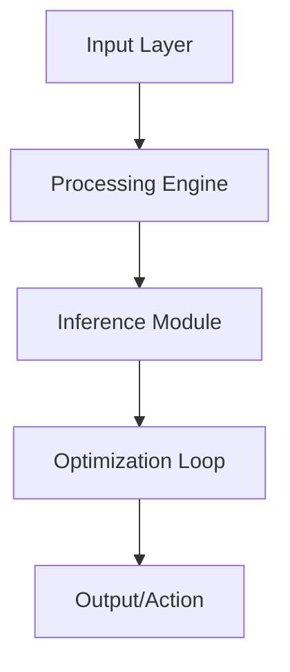

# 🤖 Quantum AI Accelerator

[](LICENSE)
[](https://www.python.org/)
[](#)

Hybrid quantum-classical optimization framework for next-gen AI workloads.

## 🏗️ Architecture



## 🌟 Key Features
- **Quantum Circuit Optimization**
- **Variational Quantum Eigensolver**
- **Quantum Embedding Layers**

## 🛠️ Technology Stack
- `Qiskit`
- `PennyLane`
- `TensorFlow Quantum`

## 🚀 Installation

```bash
git clone https://github.com/YannLeCun25/quantum-ai-accelerator.git
cd quantum-ai-accelerator
pip install -r requirements.txt
```

## 📂 Project Structure
```
├── src/            # Modular source code
├── tests/          # Unit & integration tests
├── docs/           # Technical documentation
├── requirements.txt # Dependency list
└── setup.py        # Package installation
```

Developed by **Yann LeCun** (Elite AI Engineer).
